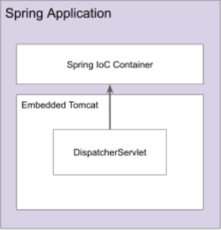
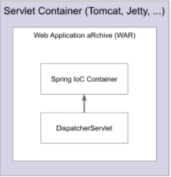

## 스프링 부트에서 JSP 사용하기
>“If possible, JSPs should be avoided. There are several known limitations when using  them with embedded servlet containers.” 
- https://docs.spring.io/spring-boot/docs/current/reference/htmlsingle/#boot-feature  s-spring-mvc-template-engines  
- 제약 사항 
    * JAR 프로젝트로 만들 수 없음, WAR 프로젝트로 만들어야 함 
    * Java -JAR로 실행할 수는 있지만 “실행가능한 JAR 파일”은 지원하지 않음 
    * 언더토우(JBoss에서 만든 서블릿 컨테이너)는 JSP를 지원하지 않음
    * Whitelabel 에러 페이지를 error.jsp로 오버라이딩 할 수 없음.
- 참고 
    * https://docs.spring.io/spring-boot/docs/current/reference/htmlsingle/#boot-features-jsp-li mitations 
    * https://github.com/spring-projects/spring-boot/tree/v2.1.1.RELEASE/spring-boot-samples /spring-boot-sample-web-jsp (샘플 프로젝트)
- 의존성 추가

    ```xml
    <dependency> 
    <groupId>javax.servlet</groupId> 
    <artifactId>jstl</artifactId> 
    </dependency> 
    <dependency> 
    <groupId>org.apache.tomcat.embed</groupId> 
    <artifactId>tomcat-embed-jasper</artifactId> 
    <scope>provided</scope> 
    </dependency>
    ```
  
- 태그 선언 

    ```html
    <%@ taglib prefix="c" uri="http://java.sun.com/jsp/jstl/core"%>
    ```

- application.properties

    ```properties
    spring.mvc.view.prefix=/WEB-INF/jsp/
    spring.mvc.view.suffix=.jsp
    ```

## WAR 파일 배포하기
- java -jar를 사용해서 실행하기
  * SpringApplication.run 사용하기 

  

- 서블릿 컨테이너에 배포하기 
  * SpringBootServletInitializer (WebApplicationInitializer) 사용하기

  