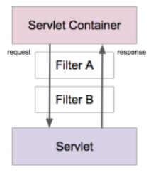
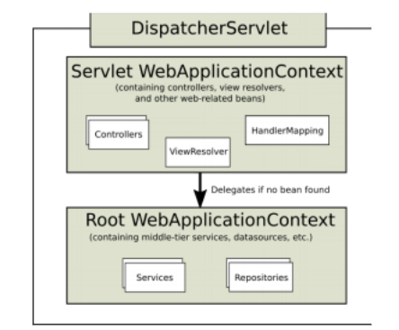

## 서블릿 애플리케이션 개발 
- 준비물: 메이븐, 톰캣
- 서블릿 구현

```java
public class HelloServlet extends HttpServlet { 
@Override 
public void init() throws ServletException { 
System.out.println("init"); 
} 
@Override 
protected void doGet(HttpServletRequest req, HttpServletResponse resp) throws ServletException, IOException { 
System.out.println("doGet"); 
resp.getWriter().write("Hello Servlet"); 
} 
@Override 
public void destroy() { 
System.out.println("destroy"); 
} 
}
```

- 서블릿 등록

```xml
<!DOCTYPE web-app PUBLIC
 "-//Sun Microsystems, Inc.//DTD Web Application 2.3//EN"
 "http://java.sun.com/dtd/web-app_2_3.dtd" >

<web-app>
  <display-name>Archetype Created Web Application</display-name>
  
  <servlet>
    <servlet-name>hello</servlet-name>
    <servlet-class>me.sungbin.HelloServlet</servlet-class>
  </servlet>
  
  <servlet-mapping>
    <servlet-name>hello</servlet-name>
    <url-pattern>/hello</url-pattern>
  </servlet-mapping>
</web-app>
```

## 서블릿 리스너와 필터
- 서블릿 리스너
    * 웹 애플리케이션에서 발생하는 주요 이벤트를 감지하고 각 이벤트에 특별한 작업이 필요한 경우에 사용할 수 있다. 
        * 서블릿 컨텍스트 수준의 이벤트 
            * 컨텍스트 라이프사이클 이벤트
            * 컨텍스트 애트리뷰트 변경 이벤트
        * 세션 수준의 이벤트 
            * 세션 라이프사이클 이벤트 
            * 세션 애트리뷰트 변경 이벤트 
- 서블릿 필터
    * 들어온 요청을 서블릿으로 보내고, 또 서블릿이 작성한 응답을 클라이언트로 보내기 전에 특별한 처리가 필요한 경우에 사용할 수 있다.
    * 체인 형태의 구조 

    

- 참고 
    * https://docs.oracle.com/cd/B14099_19/web.1012/b14017/filters.htm#i1000654

## 스프링 IoC 컨테이너 연동 



> (출처: https://docs.spring.io/spring/docs/current/spring-framework-reference/web.html#mvc)

- 서블릿 애플리케이션에 스프링 연동하기 
    * 서블릿에서 스프링이 제공하는 IoC 컨테이너 활용하는 방법 
    * 스프링이 제공하는 서블릿 구현체 DispatcherServlet 사용하기 
- ContextLoaderListener 
    * 서블릿 리스너 구현체
    * ApplicationContext를 만들어 준다. 
    * ApplicationContext를 서블릿 컨텍스트 라이프사이클에 따라 등록하고 소멸시켜준다.
    * 서블릿에서 IoC 컨테이너를 ServletContext를 통해 꺼내 사용할 수 있다.

## 스프링 MVC 연동


> (출처: https://docs.spring.io/spring/docs/current/spring-framework-reference/web.html#mvc)

- 서블릿 애플리케이션에 스프링 연동하기 
    * 서블릿에서 스프링이 제공하는 IoC 컨테이너 활용하는 방법 
    * 스프링이 제공하는 서블릿 구현체 DispatcherServlet 사용하기
- DispatcherServlet
    * 스프링 MVC의 핵심. 
    * Front Controller 역할을 한다. 
- 참고 
    * http://www.corej2eepatterns.com/FrontController.htm
    * https://www.oracle.com/technetwork/java/frontcontroller-135648.html 
    * https://martinfowler.com/eaaCatalog/frontController.html

## DispatcherServlet 동작 원리 1부
- DispatcherServlet 초기화
    * 다음의 특별한 타입의 빈들을 찾거나, 기본 전략에 해당하는 빈들을 등록한다.
    * HandlerMapping: 핸들러를 찾아주는 인터페이스
    * HandlerAdapter: 핸들러를 실행하는 인터페이스
    * HandlerExceptionResolver
    * ViewResolve
- DispatcherServlet 동작 순서
    * 요청을 분석한다. (로케일, 테마, 멀티파트 등)
    * (핸들러 맵핑에게 위임하여) 요청을 처리할 핸들러를 찾는다.
    * (등록되어 있는 핸들러 어댑터 중에) 해당 핸들러를 실행할 수 있는 “핸들러 어댑터”를 찾는다.
    * 찾아낸 “핸들러 어댑터”를 사용해서 핸들러의 응답을 처리한다.
        * 들러의 리턴값을 보고 어떻게 처리할지 판단한다.
        * 뷰 이름에 해당하는 뷰를 찾아서 모델 데이터를 랜더링한다.
        * @ResponseBody가 있다면 Converter를 사용해서 응답 본문을 만들고
        * (부가적으로) 예외가 발생했다면, 예외 처리 핸들러에 요청 처리를 위임한다.
        * 최종적으로 응답을 보낸다.
- HandlerMapping
    * RequestMappingHandlerMapping
- HandlerAdapter
    * RequestMappingHandlerAdapter

## DispatcherServlet 동작 원리 2부: SimpleController 
- HandlerMapping 
    * BeanNameUrlHandlerMapping 
- HandlerAdapter
    * SimpleControllerHandlerAdapter

    ```java
    @org.springframework.stereotype.Controller("/simple") 
    public class SimpleController implements Controller { 
        @Override 
        public ModelAndView handleRequest(HttpServletRequest request, HttpServletResponse response) throws Exception { 
        return new ModelAndView("/WEB-INF/simple.jsp"); 
        } 
    }
    ```